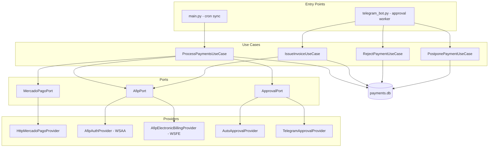
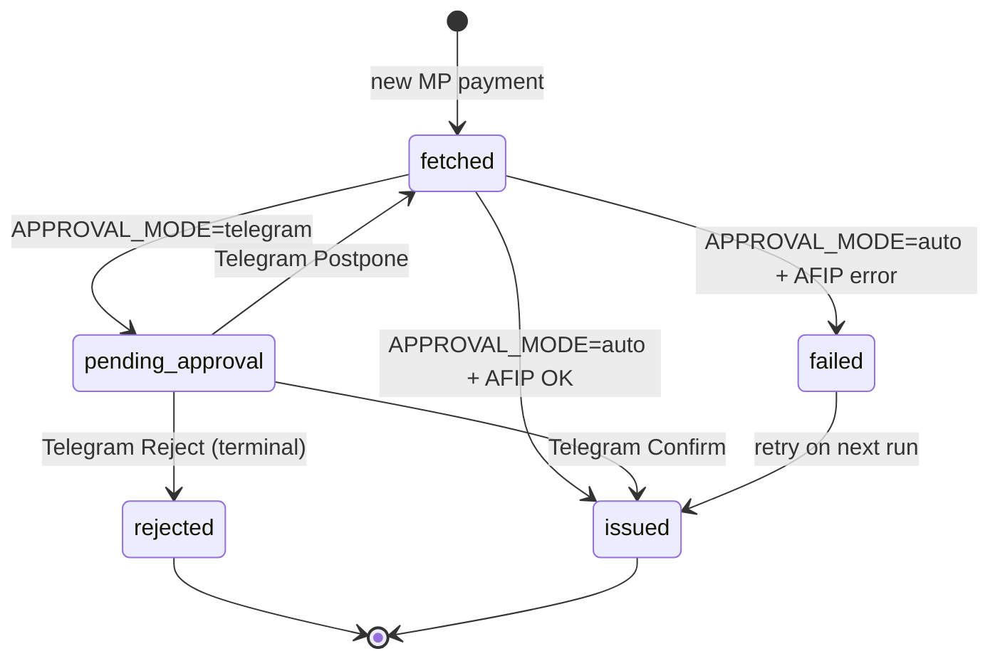

# arca-automation

Automates invoicing for MercadoPago income payments through AFIP (Argentina). Fetches transfers from MercadoPago, optionally asks for human approval via Telegram, and issues **Factura C** vouchers to **Consumidor Final** through AFIP WSFE.

## Overview

| Layer | Responsibility |
|---|---|
| **Domain** | Models, ports (interfaces), business rules |
| **Use cases** | Workflow orchestration |
| **Providers** | External integrations (MercadoPago, AFIP, Telegram) |
| **Repository** | SQLite persistence |
| **Bootstrap** | Dependency wiring from environment |

The design follows **ports & adapters**: use cases depend on protocols (`MercadoPagoPort`, `AfipPort`, `ApprovalPort`), not concrete implementations.

## Architecture



## Payment lifecycle



| Status | Meaning | Retries? |
|---|---|---|
| `fetched` | Seen from MP, not yet invoiced or re-offered | Yes |
| `pending_approval` | Telegram message sent, awaiting decision | No until you act |
| `issued` | CAE obtained from AFIP | — |
| `failed` | AFIP technical error | Yes |
| `rejected` | User rejected via Telegram | **No — terminal** |

## Project structure

```
arca-automation/
├── main.py                 # Cron/sync entry point
├── telegram_bot.py         # Telegram approval worker (long-running)
├── payments.db             # SQLite state (created at runtime)
├── certs/                  # AFIP certificate + private key (gitignored)
├── src/
│   ├── bootstrap.py        # Config loading + factory functions
│   ├── domain/
│   │   ├── models.py       # MercadoPagoPayment, IssuedInvoice, InvoicePreview
│   │   ├── ports.py        # Protocol interfaces
│   │   ├── config.py       # ApprovalConfig
│   │   ├── exceptions.py
│   │   ├── datetime_utils.py
│   │   └── income.py       # MP income detection rules
│   ├── use_cases/
│   │   ├── process_payments.py
│   │   ├── issue_invoice.py
│   │   ├── reject_payment.py
│   │   └── postpone_payment.py
│   ├── providers/
│   │   ├── mercadopago.py
│   │   ├── afip/
│   │   │   ├── auth.py           # WSAA authentication
│   │   │   ├── afip_electronic_billing.py  # WSFE invoicing
│   │   │   └── transport.py      # SSL fix for AFIP legacy DH
│   │   └── approval/
│   │       ├── auto.py
│   │       └── telegram.py
│   └── repositories/
│       └── payment_repository.py
└── tests/
```

## Requirements

- **Python** ≥ 3.13
- **[uv](https://github.com/astral-sh/uv)** (package manager)
- **OpenSSL** (for WSAA CMS signing)
- MercadoPago API access token
- AFIP production certificate + private key
- (Optional) Telegram bot token + chat ID

### Dependencies

| Package | Purpose |
|---|---|
| `httpx` | MercadoPago + Telegram HTTP |
| `zeep` | AFIP SOAP (WSAA, WSFE) |
| `pydantic` | Domain models |
| `python-dotenv` | `.env` loading |
| `cryptography`, `lxml` | zeep / SSL stack |

## Setup

### 1. Install

```bash
git clone <repo>
cd arca-automation
uv sync
```

### 2. AFIP certificates

Place your AFIP production cert and key in `certs/` (directory is gitignored):

```
certs/cert.crt
certs/private.key
```

### 3. Environment variables

Create a `.env` file at the project root:

```env
# MercadoPago
MP_ACCESS_TOKEN=APP_USR-...
MP_USER_ID=123456789

# AFIP
AFIP_CUIT=20123456789
AFIP_CERT_PATH=certs/cert.crt
AFIP_KEY_PATH=certs/private.key

# Approval (optional)
APPROVAL_MODE=auto          # or "telegram"
TELEGRAM_BOT_TOKEN=         # required if mode=telegram
TELEGRAM_CHAT_ID=           # required if mode=telegram
```

### 4. Telegram setup (manual approval)

1. Create a bot via [@BotFather](https://t.me/BotFather)
2. Send a message to your bot
3. Get your `chat_id` from `https://api.telegram.org/bot<TOKEN>/getUpdates`
4. Set `APPROVAL_MODE=telegram`, `TELEGRAM_BOT_TOKEN`, and `TELEGRAM_CHAT_ID`

## Running

### Auto mode (no Telegram)

```bash
uv run main.py
```

Invoices are issued immediately for all `fetched` payments.

### Telegram approval mode

Two processes are required:

**Terminal 1 — bot (always on):**

```bash
uv run telegram_bot.py
```

**Terminal 2 — sync (cron or manual):**

```bash
uv run main.py
```

### Cron example (23:00 ART ≈ 02:00 UTC)

```cron
0 2 * * * cd /path/to/arca-automation && uv run main.py >> logs/cron.log 2>&1
```

## Observability

Logging uses Python's stdlib `logging` throughout. The backend is chosen once at startup via `OBSERVABILITY_BACKEND` — no code changes needed to switch providers.

| Backend | Config | Install |
|---|---|---|
| `stdio` (default) | No extra vars | `uv sync` |
| `logfire` | `LOGFIRE_TOKEN` | `uv sync --extra logfire` |
| `sentry` | `SENTRY_DSN` | `uv sync --extra sentry` |

### Examples

**Logfire:**

```env
OBSERVABILITY_BACKEND=logfire
LOGFIRE_TOKEN=your-write-token
SERVICE_NAME=arca-automation
```

**Stdout only (no external provider):**

```env
OBSERVABILITY_BACKEND=stdio
```

Or omit `OBSERVABILITY_BACKEND` entirely — stdout is the default.

**Sentry:**

```env
OBSERVABILITY_BACKEND=sentry
SENTRY_DSN=https://xxx@xxx.ingest.sentry.io/xxx
```

Both `main.py` and `telegram_bot.py` call `configure_observability()` at startup.

## Payment statuses

| Status | Meaning |
|---|---|
| `fetched` | New from MP, awaiting processing |
| `pending_approval` | Telegram message sent |
| `issued` | Invoiced with CAE |
| `failed` | AFIP error (retries) |
| `rejected` | User rejected (terminal) |
For Telegram mode, run `telegram_bot.py` as a systemd service (or similar) so it stays alive between syncs.

## Workflows

### Sync pipeline (`main.py` → `ProcessPaymentsUseCase`)

1. Compute current-month date range in ART (`NOW-NDAYS` … `NOW`)
2. Fetch income payments from MercadoPago (paginated)
3. Insert new payments as `fetched`
4. For each `fetched` payment:
   - **auto**: call AFIP → `issued` or `failed`
   - **telegram**: build preview, send Telegram message → `pending_approval`

### Telegram bot (`telegram_bot.py`)

Polls Telegram for inline button callbacks:

| Button | Action | Result |
|---|---|---|
| ✅ Confirmar | `IssueInvoiceUseCase` | `issued` or `failed` |
| ❌ Rechazar | `RejectPaymentUseCase` | `rejected` (terminal) |
| ⏸ Posponer | `PostponePaymentUseCase` | back to `fetched`; re-offered on next sync |

Multiple payments produce **one Telegram message each**, sent in the same sync run. Decisions are independent and can happen in any order. Payments in `pending_approval` are not re-notified until postponed or decided.

## AFIP invoice defaults

Configured in `src/providers/afip/afip_electronic_billing.py`:

| Field | Value | Meaning |
|---|---|---|
| `CbteTipo` | 11 | Factura C |
| `PtoVta` | 2 | Point of sale 2 |
| `Concepto` | 2 | Servicios |
| `DocTipo` | 99 | Consumidor Final |
| `DocNro` | 0 | No document number |
| `CondicionIVAReceptorId` | 5 | Consumidor Final |
| `ImpTotal` / `ImpNeto` | payment amount | No IVA breakdown |
| `ImpIVA` | 0 | Monotributo-style |
| `MonId` | PES | Argentine pesos |

Service dates (`FchServDesde`, `FchServHasta`, `FchVtoPago`, `CbteFch`) use the MercadoPago payment date.

## AFIP authentication

`AfipAuthProvider` (`src/providers/afip/auth.py`):

1. Builds a Login Ticket Request (TRA) in **Argentina local time**
2. Signs it with OpenSSL CMS
3. Exchanges it at WSAA for `token` + `sign`
4. **Caches credentials** and renews ~5 minutes before expiration

WSFE calls reuse cached credentials via `AfipElectronicBillingProvider`.

## Database schema

SQLite table `payments`:

| Column | Type | Description |
|---|---|---|
| `mp_payment_id` | INTEGER PK | MercadoPago payment ID |
| `status` | TEXT | Lifecycle status |
| `transaction_amount` | REAL | Amount in ARS |
| `date_created` | TEXT | Payment datetime (ISO) |
| `cae` | TEXT | AFIP CAE (when issued) |
| `cae_expiry` | TEXT | CAE expiration |
| `invoice_number` | INTEGER | Voucher number |
| `error_message` | TEXT | Failure/rejection reason |
| `created_at` / `updated_at` | TEXT | Audit timestamps |

## Testing

```bash
uv run pytest          # all tests
uv run pytest -q       # quiet
```

Coverage includes MercadoPago income rules, AFIP auth caching, approval flow, and Telegram message formatting.

## Extensibility

The codebase is structured for per-user configuration:

- `ApprovalPort` — swap `auto` / `telegram` / future channels
- `ApprovalConfig` — feature flags per tenant
- `bootstrap.py` — composition root; can be extended to load `TenantConfig` from DB
- Ports isolate MercadoPago, AFIP, and approval from business logic

## Troubleshooting

| Issue | Cause / fix |
|---|---|
| `DH_KEY_TOO_SMALL` SSL error | Handled by `src/providers/afip/transport.py` (`SECLEVEL=1`) |
| `generationTime inválido` | TRA must use ART, not UTC — fixed in `auth.py` |
| Payments stuck in `fetched` | Telegram mode: run `telegram_bot.py` |
| Payments stuck in `pending_approval` | Decide in Telegram, or postpone to retry later |
| `rejected` won't retry | By design — terminal status |
| Bot button does nothing | Restart `telegram_bot.py` after code changes |
| Cert not found | Check `AFIP_CERT_PATH` / `AFIP_KEY_PATH` in `.env` |

## Entry points

| Command | When to run | Purpose |
|---|---|---|
| `uv run main.py` | Cron / manual | Fetch MP payments, submit for approval or auto-invoice |
| `uv run telegram_bot.py` | Always (telegram mode) | Handle approve / reject / postpone callbacks |
