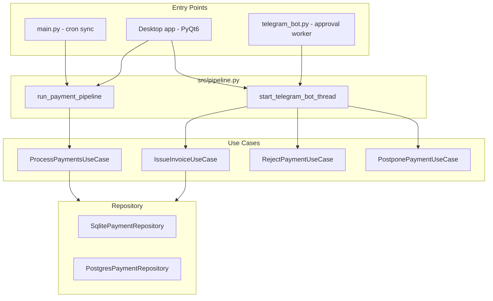
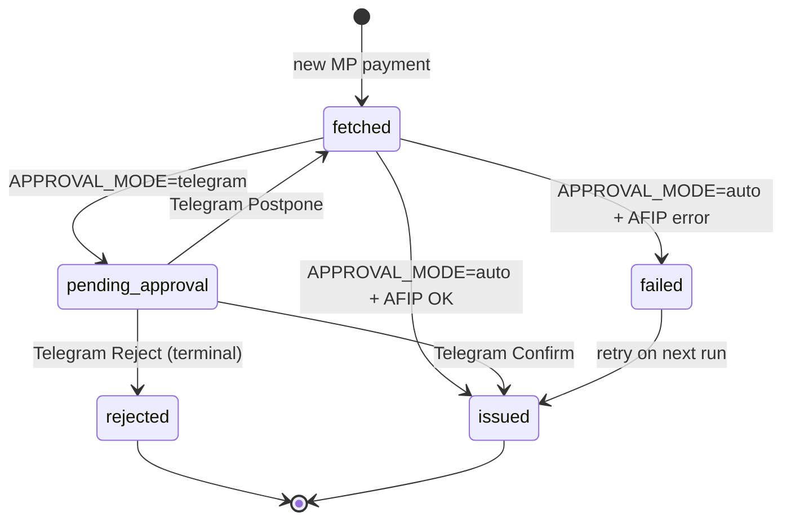

# arca-automation (Facturador AFIP)

Automatiza la facturación de cobros de MercadoPago a través de AFIP (Argentina). Obtiene transferencias, opcionalmente pide aprobación humana vía Telegram, y emite **Factura C** a **Consumidor Final** por WSFE.

**Desarrollado por [Damian Debortoli](https://www.ddebortoli.dev/)** — [developer.ddebortoli@gmail.com](mailto:developer.ddebortoli@gmail.com)

Licencia: [MIT](LICENSE) — software libre; se requiere conservar el aviso de copyright.

---

## Modos de uso

El mismo núcleo (`src/`) se puede ejecutar de dos formas:

| Modo | Para quién | Config | Entry points |
|------|------------|--------|--------------|
| **Servidor / scripts** | Cron, VPS, desarrollo | `.env` en el repo | `main.py`, `telegram_bot.py` |
| **Desktop (PyQt6)** | Usuario final en su PC | `~/.facturador/.env` | App GUI o `Facturador.app` / `.exe` |

```bash
# Servidor — sync
uv run main.py

# Servidor — bot Telegram (proceso aparte, modo telegram)
uv run telegram_bot.py

# Desktop — desarrollo
uv run desktop/facturador_pyqt6_app/main.py

# Desktop — ejecutable empaquetado (macOS)
open dist/Facturador.app
```

---

## Características

- Integración **MercadoPago** → pagos de ingreso del usuario autenticado
- Emisión **AFIP WSFE** (Factura C, Consumidor Final) con certificado propio
- Modo **auto** o aprobación manual por **Telegram** (grupo o chat privado)
- Persistencia **SQLite** local (sin config) o **PostgreSQL** remoto (Supabase, etc.)
- **App de escritorio** PyQt6: configuración guiada, certificados, ejecución in-process
- **Exportar / importar** configuración (`.facturador.json`)
- **Empaquetado** con PyInstaller (`.app`, `.exe`, Linux)
- Observabilidad opcional: stdout, Logfire, Sentry

---

## Overview

| Layer | Responsibility |
|-------|----------------|
| **Domain** | Models, ports (interfaces), business rules |
| **Use cases** | Workflow orchestration |
| **Providers** | MercadoPago, AFIP, Telegram, observability |
| **Repository** | SQLite or PostgreSQL persistence |
| **Pipeline** | Shared entry points for CLI and desktop |
| **Bootstrap** | Dependency wiring from environment |

Diseño **ports & adapters**: los use cases dependen de protocolos (`MercadoPagoPort`, `AfipPort`, `ApprovalPort`, `PaymentRepositoryPort`), no de implementaciones concretas.

---

## Architecture



---

## Payment lifecycle



| Status | Meaning | Retries? |
|--------|---------|----------|
| `fetched` | Seen from MP, not yet invoiced or re-offered | Yes |
| `pending_approval` | Telegram message sent, awaiting decision | No until you act |
| `issued` | CAE obtained from AFIP | — |
| `failed` | AFIP technical error | Yes |
| `rejected` | User rejected via Telegram | **No — terminal** |

---

## Project structure

```
arca-automation/
├── main.py                      # CLI sync entry point
├── telegram_bot.py              # Telegram approval worker (long-running)
├── LICENSE                      # MIT
├── packaging/facturador.spec    # PyInstaller spec
├── scripts/
│   ├── build_desktop.sh         # Build .app / Linux binary
│   └── build_desktop.ps1        # Build Windows .exe
├── desktop/facturador_pyqt6_app/
│   ├── main.py                  # Desktop entry point
│   ├── core/                    # Config, paths, export/import
│   └── ui/                      # PyQt6 tabs
├── docs/                        # PDF guides (bundled in desktop build)
├── src/
│   ├── bootstrap.py             # Config + factory functions
│   ├── pipeline.py              # Shared pipeline + Telegram thread
│   ├── paths.py                 # ~/.facturador paths
│   ├── metadata.py              # Authorship
│   ├── domain/
│   ├── use_cases/
│   ├── providers/
│   └── repositories/
│       ├── sqlite_payment_repository.py
│       └── postgres_payment_repository.py
└── tests/
```

---

## Requirements

- **Python** ≥ 3.13
- **[uv](https://github.com/astral-sh/uv)**
- **OpenSSL** on PATH (firma WSAA CMS; requerido también en builds empaquetados)
- Token MercadoPago, certificado AFIP producción + clave privada
- (Opcional) Bot Telegram + chat/grupo ID
- (Opcional) PostgreSQL (`DATABASE_URL`) para multi-dispositivo

### Dependencies

| Package | Purpose |
|---------|---------|
| `httpx` | MercadoPago + Telegram HTTP |
| `zeep` | AFIP SOAP (WSAA, WSFE) |
| `pydantic` | Domain models |
| `python-dotenv` | `.env` loading |
| `psycopg` | PostgreSQL repository |
| `PyQt6` | Desktop app |
| `cryptography`, `lxml` | zeep / SSL stack |

---

## Setup (servidor / CLI)

### 1. Install

```bash
git clone <repo>
cd arca-automation
uv sync
```

### 2. AFIP certificates

Colocá cert y key de AFIP (producción) en `certs/` (gitignored) o paths absolutos en `.env`:

```
certs/cert.crt
certs/private.key
```

### 3. Environment variables

Creá `.env` en la raíz del repo:

```env
# MercadoPago
MP_ACCESS_TOKEN=APP_USR-...
MP_USER_ID=123456789

# AFIP
AFIP_CUIT=20123456789
AFIP_CERT_PATH=certs/cert.crt
AFIP_KEY_PATH=certs/private.key

# Database (optional — default: SQLite in ~/.facturador/payments.db)
DATABASE_BACKEND=sqlite          # sqlite | postgres
DATABASE_PATH=                   # optional; empty = ~/.facturador/payments.db
DATABASE_URL=                    # required if postgres

# Approval (optional)
APPROVAL_MODE=auto               # auto | telegram
TELEGRAM_BOT_TOKEN=
TELEGRAM_CHAT_ID=                # chat privado o grupo (-100...)

# WSFE overrides (optional — desktop UI can set these too)
AFIP_WSFE_PUNTO_DE_VENTA=2
AFIP_WSFE_TIPO_FACTURA=11
# ...

# Observability (optional)
OBSERVABILITY_BACKEND=stdio      # stdio | logfire | sentry
```

Para mantener la DB en el repo (servidor legacy):

```env
DATABASE_PATH=/path/to/arca-automation/payments.db
```

---

## Desktop app

### Configuración

La app guarda todo en `~/.facturador/`:

| Path | Content |
|------|---------|
| `~/.facturador/.env` | Variables de entorno |
| `~/.facturador/certs/` | Certificado AFIP + clave |
| `~/.facturador/payments.db` | SQLite por defecto |

Al ejecutar, la UI setea `ARC_ENV_FILE` y corre el pipeline **in-process** (sin `uv run` subprocess).

### Tabs

- **Configuración** — MP, AFIP, WSFE, Telegram, base de datos, export/import
- **Certificados** — generar CSR, importar `cert.crt`
- **Ejecutar** — sync + logs en pantalla

### Base de datos

| Modo | Cuándo |
|------|--------|
| **SQLite local** | Default, cero config |
| **PostgreSQL** | Supabase / Neon / propio — pegar connection string URI |

### Export / import

- **Exportar** → `*.facturador.json` (incluye tokens y certs — **no commitear**)
- **Importar** → reemplaza valores; campos vacíos en el archivo conservan el valor actual

### Telegram en desktop

- Un solo bot thread por proceso (re-ejecutar no abre otro poller)
- Si otro dispositivo ya hace polling → log: *"Otro dispositivo está usando la conexión del bot…"*
- Para grupo: agregar el bot al grupo y usar el `chat_id` del grupo (`-100…`)

### Build ejecutable

```bash
./scripts/build_desktop.sh          # macOS / Linux
# .\scripts\build_desktop.ps1       # Windows
```

| OS | Output |
|----|--------|
| macOS | `dist/Facturador.app` |
| Linux | `dist/Facturador/Facturador` |
| Windows | `dist\Facturador\Facturador.exe` |

Distribuí la carpeta completa en Windows (no solo el `.exe`). OpenSSL debe estar disponible en el sistema.

---

## Running (servidor)

### Auto mode

```bash
uv run main.py
```

### Telegram approval mode

**Terminal 1 — bot (siempre activo):**

```bash
uv run telegram_bot.py
```

**Terminal 2 — sync (cron o manual):**

```bash
uv run main.py
```

### Cron (23:00 ART ≈ 02:00 UTC)

```cron
0 2 * * * cd /path/to/arca-automation && uv run main.py >> logs/cron.log 2>&1
```

En modo Telegram, `telegram_bot.py` debe correr como servicio (systemd, etc.).

---

## Observability

| Backend | Config | Install |
|---------|--------|---------|
| `stdio` (default) | — | `uv sync` |
| `logfire` | `LOGFIRE_TOKEN` | `uv sync --extra logfire` |
| `sentry` | `SENTRY_DSN` | `uv sync --extra sentry` |

---

## AFIP invoice defaults

| Field | Value | Meaning |
|-------|-------|---------|
| `CbteTipo` | 11 | Factura C |
| `PtoVta` | 2 | Point of sale 2 |
| `Concepto` | 2 | Servicios |
| `DocTipo` | 99 | Consumidor Final |
| `CondicionIVAReceptorId` | 5 | Consumidor Final |

Configurable vía env `AFIP_WSFE_*` o la UI desktop.

---

## Database schema

Table `payments` (SQLite y PostgreSQL):

| Column | Description |
|--------|-------------|
| `mp_payment_id` | MercadoPago payment ID (PK) |
| `status` | Lifecycle status |
| `transaction_amount` | Amount in ARS |
| `cae`, `cae_expiry`, `invoice_number` | AFIP result when issued |
| `error_message` | Failure/rejection reason |
| `created_at`, `updated_at` | Audit timestamps |

---

## Testing & formatting

```bash
uv run pytest -q
uv run black --check .
uv run black .    # format
```

---

## Troubleshooting

| Issue | Cause / fix |
|-------|-------------|
| `DH_KEY_TOO_SMALL` | Handled in `src/providers/afip/transport.py` |
| Payments stuck in `fetched` | Telegram: run bot / desktop with listener active |
| Telegram 409 Conflict | Otro dispositivo o `telegram_bot.py` ya hace polling |
| Bot no responde en desktop | Segunda ejecución reutiliza el mismo thread; revisar logs |
| Cert not found | `AFIP_CERT_PATH` / paths en `~/.facturador/certs/` |
| Desktop sin logs | Ver panel "Log de ejecución"; stderr en terminal si corrés desde CLI |

---

## Entry points

| Command | When | Purpose |
|---------|------|---------|
| `uv run main.py` | Cron / manual | Fetch MP, approve or auto-invoice |
| `uv run telegram_bot.py` | Telegram mode (servidor) | Handle approve / reject / postpone |
| `uv run desktop/.../main.py` | Desktop dev | GUI |
| `dist/Facturador.app` | Desktop distribuido | GUI empaquetada |

---

## License & authorship

Copyright (c) 2026 **Damian Debortoli** — [ddebortoli.dev](https://www.ddebortoli.dev/) — [developer.ddebortoli@gmail.com](mailto:developer.ddebortoli@gmail.com)

Released under the [MIT License](LICENSE). Podés usar, modificar y distribuir el software libremente; debés incluir el aviso de copyright y la licencia en copias o derivados.
